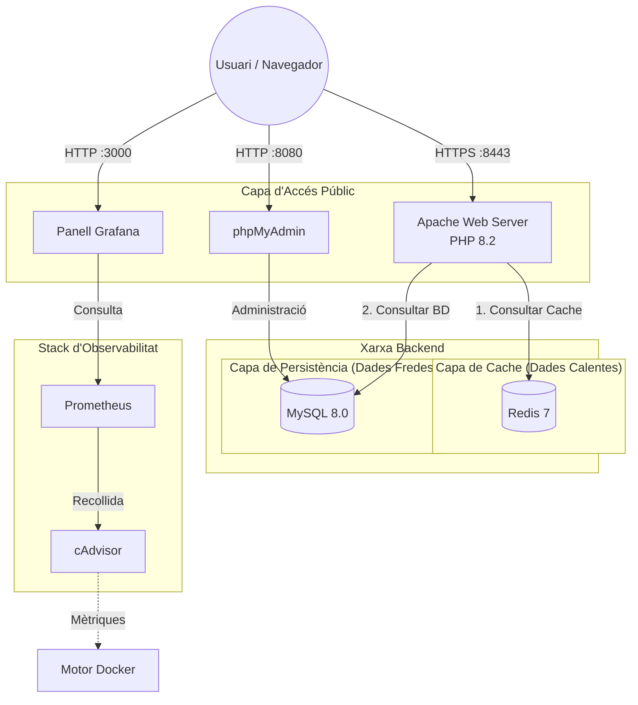

# Projecte Final d'Integració

Aquest projecte consisteix en una aplicació web completa desplegada mitjançant **Docker Compose**. Integra diversos serveis per simular un entorn de producció real amb separació de responsabilitats, seguretat, rendiment i monitorització avançada.

## 🏗️ Arquitectura del Sistema

El sistema es basa en una arquitectura de **microserveis** contenidoritzats amb Docker, dissenyada per ser robusta, segura i observable. L'arquitectura es divideix lògicament en capes de servei i xarxes aïllades.



### 🧩 Components del Sistema

#### 1. Capa d'Aplicació (Frontend & API)
*   **Apache HTTP Server**: Actua com a punt d'entrada únic. Configurat amb **Virtual Hosts** per separar el trànsit web (`frontend.local`) del trànsit de l'API (`api.local`). Gestiona la seguretat SSL/TLS i serveix l'aplicació PHP.

#### 2. Capa de Dades
*   **MySQL 8.0**: Base de dades relacional principal. Emmagatzema la informació persistent (usuaris, articles) en un volum dedicat per garantir la durabilitat de les dades.
*   **Redis 7**: Magatzem de dades en memòria (Key-Value Store). Utilitzat per a operacions d'alt rendiment com el comptador de visites en temps real.

#### 3. Eines de Gestió i Monitorització
*   **phpMyAdmin**: Client web per a la gestió visual i administració de la base de dades MySQL.
*   **Stack de Monitorització**:
    *   **cAdvisor**: Recull mètriques de baix nivell (CPU, RAM, I/O) de tots els contenidors en execució.
    *   **Prometheus**: Centralitza i emmagatzema les mètriques en una base de dades de sèries temporals.
    *   **Grafana**: Visualitza les dades de Prometheus mitjançant quadres de comandament (dashboards) intuïtius.

---

## 📂 Estructura del Projecte

```text
projecte-final/
├── docker-compose.yml      # Orquestració de tots els serveis (App + Monitoring)
├── .env                    # Variables d'entorn (credencials, ports)
├── README.md               # Documentació completa
├── apache/
│   ├── Dockerfile          # Imatge personalitzada (Alpine + PHP8.2 + Exts)
│   ├── conf/
│   │   ├── httpd.conf      # Configuració Apache
│   │   └── vhosts/         # Virtual Hosts (Frontend i API)
│   │       ├── frontend.conf
│   │       └── api.conf
│   └── sites/              # Codi font PHP
│       ├── frontend/       # Web App
│       └── api/            # API REST
├── mysql/
│   └── init/
│       └── 01-schema.sql   # Schema inicial de la BD
├── prometheus/
│   └── prometheus.yml      # Configuració de scraping de Prometheus
└── logs/                   # Logs persistents d'Apache
```

---

## 🚀 Guia d'Implementació i Desplegament

### 1. Requisits Previs
*   **Docker Desktop** instal·lat.
*   Ports lliures: **8000, 8443** (Web), **8080** (PMA), **3000** (Grafana), **9090** (Prometheus).

### 2. Configuració de DNS Local
Edita el fitxer `hosts` (`C:\Windows\System32\drivers\etc\hosts` o `/etc/hosts`) i afegeix:
```text
127.0.0.1 frontend.local
127.0.0.1 api.local
```

### 3. Desplegament
Des de la carpeta del projecte:
```bash
docker-compose up -d --build
```

### 4. Accés als Serveis

| Servei | URL | Credencials (si cal) |
|--------|-----|----------------------|
| **Frontend** | [https://frontend.local:8443](https://frontend.local:8443) | - |
| **API** | [https://api.local:8443/api/articles](https://api.local:8443/api/articles) | - |
| **phpMyAdmin** | [http://localhost:8080](http://localhost:8080) | User: `appuser` / Pass: `apppassword` |
| **Grafana** | [http://localhost:3000](http://localhost:3000) | User: `admin` / Pass: `admin` |
| **Prometheus** | [http://localhost:9090](http://localhost:9090) | - |

---

## 📊 Configuració del Dashboard de Monitorització

Per visualitzar les mètriques del sistema:

1.  Entra a **Grafana** ([http://localhost:3000](http://localhost:3000)).
2.  Afegeix **Prometheus** com a Data Source:
    *   URL: `http://prometheus:9090`
3.  Importa el Dashboard ID **14282** ("Docker Container & Host Metrics").
4.  Selecciona la font de dades Prometheus i gaudeix de les gràfiques en temps real de tots els contenidors.

---

## 📸 Guia de Comprovació Pas a Pas

Aquesta secció documenta el procés de validació del projecte, seguint els criteris d'avaluació.

### Pas 1: Inici del Stack
Execució de la comanda `docker-compose up -d --build` per aixecar tota la infraestructura.
> **Evidència 1**: Captura del terminal mostrant la creació exitosa dels contenidors.
*(Enganxa la captura aquí)*

### Pas 2: Verificació d'Estat
Comprovació que tots els contenidors estan "Up" i els healthchecks (MySQL) estan "healthy" amb `docker-compose ps`.
> **Evidència 2**: Captura de la sortida de `docker-compose ps`.
*(Enganxa la captura aquí)*

### Pas 3: Accés Web i HTTPS
Accés a `http://frontend.local:8000`. S'ha de verificar:
1.  Redirecció automàtica a HTTPS (port 8443).
2.  Avís de certificat auto-signat (demostra que SSL funciona).
3.  Càrrega correcta de la pàgina principal.
> **Evidència 3**: Captura del navegador mostrant la pàgina principal carregada amb el cadenat de seguretat (o l'avís).
*(Enganxa la captura aquí)*

### Pas 4: Funcionament de Redis
En refrescar la pàgina, el comptador de "Total Page Visits" ha d'incrementar-se.
> **Evidència 4**: Captura mostrant el comptador de visites amb un valor superior a 1.
*(Enganxa la captura aquí)*

### Pas 5: API REST
Accés a l'endpoint `https://api.local:8443/api/articles` per verificar que retorna JSON.
> **Evidència 5**: Captura de la resposta JSON amb la llista d'articles.
*(Enganxa la captura aquí)*

### Pas 6: Administració de Base de Dades
Accés a phpMyAdmin (`http://localhost:8080`) i verificació de les taules creades.
> **Evidència 6**: Captura de phpMyAdmin mostrant l'estructura de la taula `articles` o `users`.
*(Enganxa la captura aquí)*

### Pas 7: Monitorització (Bonus)
Accés a Grafana (`http://localhost:3000`) per veure les mètriques en temps real.
> **Evidència 7**: Captura del Dashboard de Grafana amb les gràfiques de CPU/RAM dels contenidors.
*(Enganxa la captura aquí)*

### Pas 8: Logs
Verificació que els logs d'Apache s'estan escrivint a la carpeta local `./logs`.
> **Evidència 8**: Captura de l'explorador de fitxers o terminal mostrant el contingut de la carpeta `logs`.
*(Enganxa la captura aquí)*

---

## 🛠️ Detalls Tècnics Destacats

*   **Seguretat**: Redirecció automàtica HTTP->HTTPS (codi 301), HSTS activat, i xarxes Docker segregades (Frontend vs Backend).
*   **Eficiència**: Ús d'imatges Alpine Linux per reduir la mida dels contenidors.
*   **Persistència**: Volums Docker per a MySQL, Redis, Prometheus i Grafana per no perdre dades ni configuracions.
*   **Observabilitat**: Implementació completa de monitorització per tenir control total sobre l'estat de la infraestructura.
