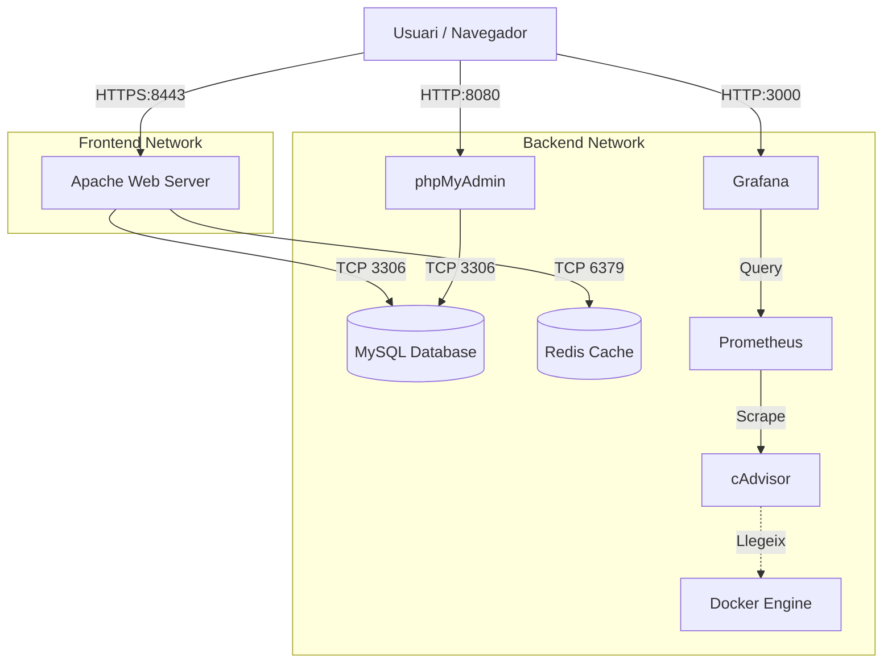

# Projecte Final d'Integració

Aquest projecte consisteix en una aplicació web completa desplegada mitjançant **Docker Compose**. Integra diversos serveis per simular un entorn de producció real amb separació de responsabilitats, seguretat, rendiment i monitorització avançada.

## 🏗️ Arquitectura del Sistema

El sistema utilitza una arquitectura de microserveis orquestrada, separada en xarxes per millorar la seguretat i incloent una pila de monitorització completa.



### Components Principals:
1.  **Apache (Frontend/API)**: Servidor web principal acting com a Reverse Proxy i servidor d'aplicació PHP.
    *   Gestiona `frontend.local` i `api.local`.
    *   Implementa SSL/TLS i força HTTPS.
2.  **MySQL (Base de Dades)**: Emmagatzematge persistent per a usuaris i articles.
3.  **Redis (Cache)**: Sistema de cache en memòria per al comptador de visites.
4.  **phpMyAdmin**: Interfície d'administració de base de dades.

### Stack de Monitorització (Bonus):
5.  **Prometheus**: Base de dades de sèries temporals que recull mètriques (scraping) cada 15 segons.
6.  **cAdvisor**: Analitzador que extreu dades d'ús de recursos (CPU, Memòria, Xarxa) directament del nucli de Docker.
7.  **Grafana**: Plataforma de visualització que permet crear dashboards interactius a partir de les dades de Prometheus.

---

## 📂 Estructura del Projecte

```text
projecte-final/
├── docker-compose.yml      # Orquestració de tots els serveis (App + Monitoring)
├── .env                    # Variables d'entorn (credencials, ports)
├── README.md               # Documentació completa
├── apache/
│   ├── Dockerfile          # Imatge personalitzada (Alpine + PHP8.2 + Exts)
│   ├── conf/
│   │   ├── httpd.conf      # Configuració Apache
│   │   └── vhosts/         # Virtual Hosts (Frontend i API)
│   │       ├── frontend.conf
│   │       └── api.conf
│   └── sites/              # Codi font PHP
│       ├── frontend/       # Web App
│       └── api/            # API REST
├── mysql/
│   └── init/
│       └── 01-schema.sql   # Schema inicial de la BD
├── prometheus/
│   └── prometheus.yml      # Configuració de scraping de Prometheus
└── logs/                   # Logs persistents d'Apache
```

---

## 🚀 Guia d'Implementació i Desplegament

### 1. Requisits Previs
*   **Docker Desktop** instal·lat.
*   Ports lliures: **8000, 8443** (Web), **8080** (PMA), **3000** (Grafana), **9090** (Prometheus).

### 2. Configuració de DNS Local
Edita el fitxer `hosts` (`C:\Windows\System32\drivers\etc\hosts` o `/etc/hosts`) i afegeix:
```text
127.0.0.1 frontend.local
127.0.0.1 api.local
```

### 3. Desplegament
Des de la carpeta del projecte:
```bash
docker-compose up -d --build
```

### 4. Accés als Serveis

| Servei | URL | Credencials (si cal) |
|--------|-----|----------------------|
| **Frontend** | [https://frontend.local:8443](https://frontend.local:8443) | - |
| **API** | [https://api.local:8443/api/articles](https://api.local:8443/api/articles) | - |
| **phpMyAdmin** | [http://localhost:8080](http://localhost:8080) | User: `appuser` / Pass: `apppassword` |
| **Grafana** | [http://localhost:3000](http://localhost:3000) | User: `admin` / Pass: `admin` |
| **Prometheus** | [http://localhost:9090](http://localhost:9090) | - |

---

## 📊 Configuració del Dashboard de Monitorització

Per visualitzar les mètriques del sistema:

1.  Entra a **Grafana** ([http://localhost:3000](http://localhost:3000)).
2.  Afegeix **Prometheus** com a Data Source:
    *   URL: `http://prometheus:9090`
3.  Importa el Dashboard ID **14282** ("Docker Container & Host Metrics").
4.  Selecciona la font de dades Prometheus i gaudeix de les gràfiques en temps real de tots els contenidors.

---

## 🛠️ Detalls Tècnics Destacats

*   **Seguretat**: Redirecció automàtica HTTP->HTTPS (codi 301), HSTS activat, i xarxes Docker segregades (Frontend vs Backend).
*   **Eficiència**: Ús d'imatges Alpine Linux per reduir la mida dels contenidors.
*   **Persistència**: Volums Docker per a MySQL, Redis, Prometheus i Grafana per no perdre dades ni configuracions.
*   **Observabilitat**: Implementació completa de monitorització per tenir control total sobre l'estat de la infraestructura.
