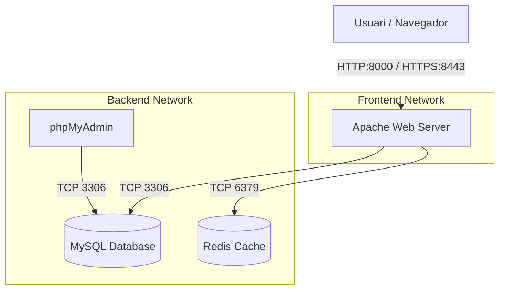

# Projecte Final d'Integració

Aquest projecte consisteix en una aplicació web completa desplegada mitjançant **Docker Compose**. Integra diversos serveis per simular un entorn de producció real amb separació de responsabilitats, seguretat i rendiment.

## 🏗️ Arquitectura del Sistema

El sistema utilitza una arquitectura de contenidors orquestrada, separada en dues xarxes per millorar la seguretat.



### Components:
1.  **Apache (Frontend/API)**: Servidor web principal.
    *   Actua com a punt d'entrada únic (Reverse Proxy).
    *   Gestiona dos Virtual Hosts: `frontend.local` i `api.local`.
    *   Implementa SSL/TLS amb certificats auto-signats.
    *   Força la redirecció HTTPS.
2.  **MySQL (Base de Dades)**: Emmagatzematge persistent.
    *   Conté les dades d'usuaris i articles.
    *   Inicialització automàtica amb dades de prova.
3.  **Redis (Cache)**: Emmagatzematge en memòria d'alt rendiment.
    *   Utilitzat per comptar les visites de la pàgina en temps real.
4.  **phpMyAdmin**: Eina d'administració.
    *   Interfície web per gestionar la base de dades MySQL visualment.

---

## 📂 Estructura del Projecte

```text
projecte-final/
├── docker-compose.yml      # Definició de tots els serveis i xarxes
├── .env                    # Variables d'entorn (credencials, ports)
├── README.md               # Documentació del projecte
├── apache/
│   ├── Dockerfile          # Imatge personalitzada d'Apache + PHP + Extensions
│   ├── conf/
│   │   ├── httpd.conf      # Configuració principal d'Apache
│   │   └── vhosts/         # Configuració dels Virtual Hosts
│   │       ├── frontend.conf
│   │       └── api.conf
│   └── sites/              # Codi font de les aplicacions
│       ├── frontend/       # Web principal (HTML/PHP)
│       └── api/            # API REST (PHP)
├── mysql/
│   └── init/
│       └── 01-schema.sql   # Script SQL per crear taules i dades inicials
└── logs/                   # Logs d'accés i error d'Apache (muntats des del contenidor)
```

---

## 🚀 Guia d'Implementació i Desplegament

Segueix aquests passos per posar en marxa el projecte des de zero.

### 1. Requisits Previs
*   Tenir **Docker Desktop** instal·lat i en execució.
*   Assegurar-se que els ports **8000**, **8443** i **8080** estan lliures a la teva màquina.

### 2. Configuració de DNS Local
Perquè els dominis `frontend.local` i `api.local` funcionin al teu ordinador, has d'editar el fitxer `hosts`.

*   **Windows**: Obre el Bloc de notes com a Administrador i edita `C:\Windows\System32\drivers\etc\hosts`.
*   **Linux/Mac**: Edita `/etc/hosts` amb `sudo`.

Afegeix aquestes línies al final del fitxer:
```text
127.0.0.1 frontend.local
127.0.0.1 api.local
```

### 3. Configuració d'Entorn
El fitxer `.env` ja està creat amb la configuració per defecte. Si necessites canviar contrasenyes, fes-ho aquí abans d'iniciar els contenidors.

### 4. Desplegament amb Docker Compose
Obre un terminal a la carpeta arrel del projecte (`projecte-final`) i executa:

```bash
docker-compose up -d --build
```

*   `up`: Crea i inicia els contenidors.
*   `-d`: Mode "detach" (s'executa en segon pla).
*   `--build`: Força la construcció de la imatge d'Apache (necessari si has modificat el Dockerfile o configuracions).

### 5. Verificació
Executa `docker-compose ps` per veure l'estat dels serveis. Tots haurien d'estar en estat "Up" (i MySQL en estat "Healthy").

---

## 🌐 Accés a l'Aplicació

Un cop desplegat, pots accedir als diferents serveis a través de les següents URLs:

| Servei | URL | Descripció |
|--------|-----|------------|
| **Frontend Web** | [https://frontend.local:8443](https://frontend.local:8443) | Pàgina principal amb estadístiques i articles. |
| **API REST** | [https://api.local:8443/api/articles](https://api.local:8443/api/articles) | Endpoint JSON que retorna els articles. |
| **phpMyAdmin** | [http://localhost:8080](http://localhost:8080) | Gestor de base de dades. |

> **Nota de Seguretat**: En accedir per HTTPS, el navegador et mostrarà un avís de "Connexió no segura". Això és normal perquè estem utilitzant un certificat **auto-signat** generat durant el build. Has de fer clic a "Avançat" i "Acceptar el risc / Continuar".

### Credencials per defecte (phpMyAdmin)
*   **Servidor**: `mysql`
*   **Usuari**: `appuser`
*   **Contrasenya**: `apppassword`

---

## 🛠️ Detalls Tècnics i Funcionalitats

### Servidor Web (Apache)
*   **Ports Personalitzats**: S'han mapejat els ports del contenidor (80/443) als ports **8000** i **8443** del host per evitar conflictes.
*   **Redirecció HTTPS**: Qualsevol petició HTTP al port 8000 és redirigida automàticament a HTTPS al port 8443 mitjançant `RewriteRule`.
*   **Seguretat**: S'apliquen capçaleres de seguretat com HSTS, X-Frame-Options i Content-Security-Policy.
*   **Logging**: Els logs es guarden en format JSON a la carpeta `./logs` del host per facilitar la seva anàlisi.

### Aplicació PHP
*   **Connexió a Redis**: El frontend connecta amb el servei `redis` per incrementar i mostrar un comptador de visites. S'ha configurat per ignorar peticions a `favicon.ico` i evitar comptar doble.
*   **Connexió a MySQL**: Utilitza l'extensió `mysqli` per llegir i escriure articles.
*   **API REST**: Implementa endpoints GET i POST, retornant respostes en format JSON correctament formatat.

### Base de Dades
*   **Persistència**: Les dades de MySQL es guarden en un volum de Docker (`mysql_data`), de manera que no es perden si reinicies els contenidors.
*   **Inicialització**: Si la base de dades està buida, s'executa automàticament l'script `mysql/init/01-schema.sql`.

---

## ❓ Resolució de Problemes Comuns

**1. Error "Address already in use"**
Si els ports 8000, 8443 o 8080 estan ocupats, edita el fitxer `docker-compose.yml` i canvia la part esquerra del mapeig de ports (ex: `"9000:80"`).

**2. Error de connexió a la Base de Dades**
Si MySQL falla o phpMyAdmin no connecta, prova de reiniciar tot esborrant els volums per forçar una recreació neta:
```bash
docker-compose down -v
docker-compose up -d --build
```

**3. El navegador no troba frontend.local**
Assegura't que has editat correctament el fitxer `hosts` i que has desat els canvis amb permisos d'administrador.
